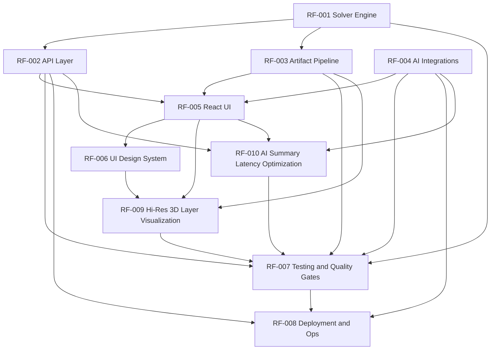

# Feature Catalog
**Last Updated:** 2026-06-29
**Total Features:** 10

---

## Features by Category

### Core Optimization Engine
| ID | Feature | Status | Priority | Release |
|----|---------|--------|----------|---------|
| RF-001 | Core Solver Engine | Implemented | Critical | Phase 1 |
| RF-003 | Artifact Pipeline and Diagram Rendering | Implemented | High | Phase 1 |
| RF-007 | Testing, Evaluation, and Quality Gates | Implemented | Critical | Phase 1 |
| RF-009 | High-Resolution 3D Isometric Layer Visualization | Specification | High | Phase 1.1 |

### API and AI Services
| ID | Feature | Status | Priority | Release |
|----|---------|--------|----------|---------|
| RF-002 | API Layer and Run Management | Implemented | Critical | Phase 1 |
| RF-004 | AI Integrations and Traceability | Implemented | High | Phase 1 |
| RF-010 | AI Summary Latency Optimization | Implemented | High | Phase 1.2 |
| RF-008 | Deployment, Security, and Operational Readiness | Implemented | High | Phase 1 |

### Frontend Experience
| ID | Feature | Status | Priority | Release |
|----|---------|--------|----------|---------|
| RF-005 | React UI Home and Run Experience | Implemented | Critical | Phase 1 |
| RF-006 | UI Design System - Precision Industrial Dark | Implemented | High | Phase 1 |

---

## Features by Status

### Implemented
- RF-001: Core Solver Engine
- RF-002: API Layer and Run Management
- RF-003: Artifact Pipeline and Diagram Rendering
- RF-004: AI Integrations and Traceability
- RF-005: React UI Home and Run Experience
- RF-006: UI Design System - Precision Industrial Dark
- RF-007: Testing, Evaluation, and Quality Gates
- RF-008: Deployment, Security, and Operational Readiness
- RF-010: AI Summary Latency Optimization

### In Development
- None

### Specification
- RF-009: High-Resolution 3D Isometric Layer Visualization

### Future
- Phase 2: Extended pallet presets and custom workflows
- Phase 2+: Mixed-SKU and non-grid layout support

---

## Feature Dependencies

---

## Coverage Report

**Documentation Coverage:**
- requirement.md top-level sections covered: 14 / 14 (100%)
- Functional requirements sections covered (4-8): 5 / 5 (100%)
- Non-functional and deployment sections covered (10, 13): 2 / 2 (100%)

**Feature Extraction Status:**
- Total major feature groups identified: 10
- Feature files created: 10
- User stories documented: 32
- Remaining to document: 0 for Step 1 MVP plus known post-MVP enhancements

---

## Source Scope

Primary source used for extraction:
- Attached document: `requirement.md`
- User request: 3D stack visibility and exploded layering enhancement (2026-04-17)
- Intake request: AI Summary latency optimization (INTAKE-2026-06-29-002)

Extraction note:
- Feature ID sequence extended to RF-009 for visualization clarity enhancement.
- Feature ID sequence extended to RF-010 for AI Summary latency optimization.
