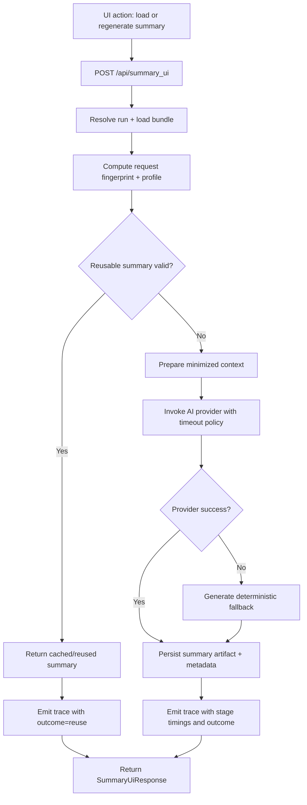

# Implementation Plan: AI Summary Latency Optimization

**Feature ID:** RF-010  
**Generated:** 2026-06-29  
**Agent:** Tech Lead (GPT-5.3-Codex)  
**Approach:** HYBRID (Modify existing summary pipeline + add performance governance)

---

## Executive Summary

**Feature:** AI Summary Latency Optimization  
**Status:** Implemented
**Implementation Approach:** HYBRID  
**Estimated Complexity:** High  
**Risk Level:** Medium-High

The repository already has working summary endpoints, basic reuse for summary_ui artifact reads, deterministic fallback behavior, and AI trace logging. RF-010 requires converting this baseline into a measurable latency program: stage timing instrumentation, critical-path optimization, safe reuse policy, timeout/fallback tuning, non-blocking UI behavior hardening, and performance regression gates.

---

## 1. Feature Analysis

### 1.1 Scope Boundaries

In scope:
1. Backend latency optimization for POST /api/summary and POST /api/summary_ui.
2. AI provider call-path optimization in scripts/pallet_coach/ai/azure_responses.py.
3. Safe summary reuse policy for repeat requests with auditable freshness criteria.
4. UI perceived-latency improvements and duplicate in-flight call protection in Run page summary flow.
5. Telemetry and automated test coverage for normal, reused, timeout/fallback, and degraded paths.
6. Release gates based on p50/p95/p99 latency and non-regression quality/reliability checks.

Out of scope (non-goals):
1. Rewriting model prompts for stylistic quality gains unrelated to latency.
2. Changing public response contracts for SummaryResponse and SummaryUiResponse.
3. Migrating to a different AI provider or model family in RF-010.
4. Broad platform observability migration (new external telemetry stack).
5. Large UI redesign outside summary workflow states.

### 1.2 Key Requirements (From RF-010)

1. Establish baseline and budget with stage-level timings.
2. Reduce dominant contributors in summary critical path.
3. Add safe reuse, timeout tuning, and responsive fallback.
4. Improve non-blocking and responsive summary UX in Run page.
5. Add observability and performance regression gates.

### 1.3 Dependencies

Prerequisites:
- RF-002 API Layer and Run Management
- RF-004 AI Integrations and Traceability
- RF-005 React UI Home and Run Experience

Related:
- RF-007 Testing, Evaluation, and Quality Gates
- RF-008 Deployment, Security, and Operational Readiness

---

## 2. Existing Implementation Assessment

## 2.1 Current Coverage Summary

Status: Implemented

What already exists:
1. POST /api/summary and POST /api/summary_ui endpoint flows.
2. summary_ui artifact reuse when summary_ui.md exists and force is false.
3. Deterministic fallback text path for summary_ui failures.
4. AI trace append and run log append on success/failure paths.
5. UI loading state and regenerate actions in Run page.

What is missing for RF-010 completion:
1. Explicit stage timing instrumentation (parse/prep/model/post/artifact/serialize).
2. Approved latency budgets and release gates in code-level validation artifacts.
3. Reuse policy beyond existing file existence checks (hash/freshness policy).
4. Timeout/retry policy controls tuned for tail-latency management.
5. Duplicate in-flight call safeguards for summary generation triggers.
6. Performance-focused automated checks and repeatable benchmark harness for summary endpoints.

## 2.2 Impact Areas (Codebase)

### Backend API summary path

Primary files:
- scripts/pallet_coach/api/app.py
- scripts/pallet_coach/api/models.py

Current behavior highlights:
1. summary endpoint calls generate_summary_markdown, writes recommendation_summary.md, updates bundle, appends trace.
2. summary_ui endpoint can short-circuit to existing summary_ui.md unless force=true.
3. fallback is currently provider-failure driven and rendered as deterministic markdown wrapper.
4. trace metadata lacks formal stage timings and path classification (cache/reuse vs model vs fallback).

RF-010 impact:
1. Introduce pipeline stage timing envelope around summary and summary_ui paths.
2. Add explicit path outcome labels (normal_generation, reused_artifact, fallback_timeout, fallback_error).
3. Add policy checks for reuse eligibility and freshness, not only file presence.
4. Add configurable timeout/retry/fallback policy and bounded retries.

### AI provider calls

Primary file:
- scripts/pallet_coach/ai/azure_responses.py

Current behavior highlights:
1. build_minimized_bundle runs per request.
2. prompt strings are assembled with json.dumps(minimized, indent=2).
3. single httpx.post call with timeout from AZURE_OAI_TIMEOUT_S.
4. metadata only returns top-level latency and token usage.

RF-010 impact:
1. Add stage timings inside provider wrapper (request build, network call, parse).
2. Add optional precomputed/minimized context reuse for identical inputs.
3. Reduce avoidable serialization overhead in prompt assembly where safe.
4. Prepare metadata contract extension for downstream trace dimensions.

### UI run page summary experience

Primary files:
- UI/pallet_coach_ui/src/pages/Run.tsx
- UI/pallet_coach_ui/src/components/SummaryPanel.tsx
- UI/pallet_coach_ui/src/api/endpoints.ts
- UI/pallet_coach_ui/src/pages/Run.test.tsx

Current behavior highlights:
1. summaryPending auto-trigger invokes postSummaryUi(runId, false) once bundle is loaded.
2. regenerate action invokes postSummaryUi(runId, true).
3. loading state is present but no strict duplicate in-flight call registry keyed by runId.
4. summary artifact fetch and generation paths can race under quick user actions.

RF-010 impact:
1. Add explicit in-flight dedup guard for summary requests per run and request mode.
2. Show first useful feedback quickly (state transition within target budget).
3. Preserve non-blocking page interactions while summary is pending.
4. Expand tests for duplicate-click and race prevention behavior.

### Telemetry and testing surfaces

Primary files:
- scripts/pallet_coach/ai/tracing.py
- scripts/tests/test_ai_tracing.py
- scripts/tests/test_api_ai_endpoints.py

Current behavior highlights:
1. ai_calls.jsonl trace writes exist with redaction support.
2. endpoint tests validate artifact writing, force behavior, and 502 path.
3. no dedicated latency threshold tests, benchmark scripts, or payload profile sweeps.

RF-010 impact:
1. Extend trace payload dimensions for endpoint, payload profile, outcome, stage durations.
2. Add unit/integration tests for reuse/fallback/timeout policies and trace completeness.
3. Add repeatable perf harness and release gate report artifacts.

---

## 3. Architecture and Flow Changes

### 3.1 Target Runtime Flow (Summary UI endpoint)

### 3.2 Architectural Additions

1. Reuse policy module (or endpoint-local policy function) using stable fingerprint:
   - Inputs: run_id, style, source summary hash, minimized context hash, freshness timestamp.
   - Output: eligible or not eligible with reason.
2. Stage timing envelope around summary operations:
   - parse_ms, context_prep_ms, provider_ms, response_parse_ms, artifact_write_ms, serialize_ms, total_ms.
3. Outcome classification for observability:
   - generation, reuse, fallback_timeout, fallback_error, provider_error.
4. Timeout/retry/fallback policy parameters:
   - max timeout, retry count, backoff policy, fallback trigger boundary.
5. UI request dedup guard for summary actions to avoid duplicate in-flight calls.

### 3.3 Contract Compatibility

1. Keep SummaryResponse and SummaryUiResponse response schemas unchanged.
2. Keep existing artifact paths recommendation_summary.md and summary_ui.md.
3. Add metadata only in traces and logs; do not break API clients.

---

## 4. Performance Targets and Release Gates

## 4.1 Payload Profiles

Define and use three representative profiles in perf tests:
1. Small: simple run with low solution complexity.
2. Medium: typical production-like run bundle.
3. Large: high solution complexity and larger minimized context.

## 4.2 Proposed Latency Targets (to be approved by Product + Eng)

Targets are proposed for production-like environment under representative concurrency.

Endpoint: POST /api/summary
1. Small: p50 <= 1200 ms, p95 <= 2800 ms, p99 <= 5000 ms
2. Medium: p50 <= 2000 ms, p95 <= 4500 ms, p99 <= 8000 ms
3. Large: p50 <= 3500 ms, p95 <= 7000 ms, p99 <= 12000 ms

Endpoint: POST /api/summary_ui
1. Reuse path: p50 <= 250 ms, p95 <= 600 ms, p99 <= 1200 ms
2. Generate path (small): p50 <= 1400 ms, p95 <= 3200 ms, p99 <= 5500 ms
3. Generate path (medium): p50 <= 2300 ms, p95 <= 5000 ms, p99 <= 9000 ms
4. Generate path (large): p50 <= 3800 ms, p95 <= 7600 ms, p99 <= 12500 ms

UI responsiveness target:
1. First useful feedback on summary action <= 300 ms at p95.

Reliability gate:
1. Error-rate delta for summary endpoints after change <= +1.0 percentage point from baseline.

Improvement gate versus baseline:
1. p95 reduction >= 25% for at least two of three payload profiles on each endpoint.
2. p99 non-regression for all profiles (must not worsen by >10%).

## 4.3 Gate Artifacts Required

1. Baseline report (pre-change) with p50/p95/p99 by profile and endpoint.
2. Post-change report with same methodology and concurrency shape.
3. Trace sample showing stage timings for generation/reuse/fallback outcomes.
4. Signed release checklist confirming all gates passed.

---

## 5. Phased Development Plan

## Phase 0: Baseline and Budget Approval

Objectives:
1. Capture current latency baseline by endpoint/profile.
2. Identify dominant stage contributors.
3. Confirm target budgets and acceptance gates.

Tasks:
1. Define profile fixtures and request mix for baseline tests.
2. Add temporary measurement hooks if needed for stage decomposition.
3. Produce baseline report and align approved target table.

Dependencies:
- None.

Exit criteria:
1. Baseline report committed to planning artifacts.
2. Budget table approved by Product + Engineering.

## Phase 1: Stage Instrumentation and Trace Enrichment

Objectives:
1. Add durable timing and outcome telemetry in summary pipeline.
2. Keep compatibility with existing trace storage.

Tasks:
1. Instrument summary and summary_ui endpoint stages in app.py.
2. Extend provider metadata in azure_responses.py for nested timing details.
3. Extend ai trace events with endpoint, payload_profile, outcome, stage timings.
4. Add tests validating trace metadata structure and redaction compatibility.

Dependencies:
- Phase 0 budget/profile definitions.

Exit criteria:
1. Trace events consistently capture timing dimensions in tests.
2. No regression in existing tracing tests.

## Phase 2: Critical-Path Optimization

Objectives:
1. Remove avoidable synchronous overhead from generation path.
2. Reduce p95 latency without contract changes.

Tasks:
1. Optimize minimized bundle preparation and serialization path.
2. Remove repeated work that can be shared safely inside request path.
3. Streamline artifact write/update sequence where possible.
4. Re-run profile benchmark after each optimization increment.

Dependencies:
- Phase 1 instrumentation.

Exit criteria:
1. Measurable p95 improvement on generation path for both endpoints.
2. No API schema changes and no quality/safety regressions.

## Phase 3: Reuse Policy + Timeout/Retry/Fallback Tuning

Objectives:
1. Enable policy-driven reuse for repeated requests.
2. Control tail latency under provider slowness.

Tasks:
1. Implement reusable summary eligibility policy with auditable reason codes.
2. Add freshness boundary and request fingerprint checks.
3. Tune timeout and bounded retry policy for summary calls.
4. Ensure fast deterministic fallback path when policy requires.
5. Classify outcomes in traces and logs (reuse, generation, fallback_timeout, fallback_error).

Dependencies:
- Phase 1 timing/outcome telemetry.
- Phase 2 optimization baseline refresh.

Exit criteria:
1. Reuse and fallback behavior fully covered by tests.
2. Tail-latency and error-rate gates meet target.

## Phase 4: UI Responsiveness and De-duplication Hardening

Objectives:
1. Improve perceived speed and prevent duplicate in-flight summary calls.
2. Preserve non-blocking Run page behavior.

Tasks:
1. Add per-run summary in-flight guard for auto-trigger and manual regenerate.
2. Improve progress/loading state transitions to meet first-feedback target.
3. Keep existing regenerate behavior while blocking duplicate equivalent calls.
4. Expand Run page tests for race and duplicate-click scenarios.

Dependencies:
- Phase 3 outcome contract for reuse/fallback states.

Exit criteria:
1. UI tests validate dedup and state transitions.
2. Manual UAT confirms non-blocking behavior remains intact.

## Phase 5: Performance Gates, Rollout, and Verification

Objectives:
1. Validate all quality and performance gates.
2. Roll out safely with rollback criteria.

Tasks:
1. Run full benchmark suite and compare against baseline.
2. Run unit/integration/perf tests in CI.
3. Stage rollout (dev -> pre-prod -> production) with canary window.
4. Monitor post-release latency and error trend with rollback trigger thresholds.

Dependencies:
- Phases 1-4 complete.

Exit criteria:
1. All release gates passed and documented.
2. Rollout decision approved by feature owner.

---

## 6. File-Level Work Plan (Planned Changes)

### Backend/API

1. scripts/pallet_coach/api/app.py
- Add stage timing capture for summary endpoints.
- Add policy checks for reuse eligibility and outcome labels.
- Add timeout/fallback policy integration points and richer trace metadata.

2. scripts/pallet_coach/api/models.py
- Keep public schemas stable.
- Add internal typing support only if needed without contract changes.

### AI Provider

3. scripts/pallet_coach/ai/azure_responses.py
- Add timing breakdown metadata and optimize context/prompt construction path.
- Add optional helper interfaces for reuse/fingerprint support.

4. scripts/pallet_coach/ai/tracing.py
- Ensure enriched trace event dimensions are persisted with current redaction behavior.

### UI

5. UI/pallet_coach_ui/src/pages/Run.tsx
- Add in-flight dedup guard and refined loading/progress flow.

6. UI/pallet_coach_ui/src/components/SummaryPanel.tsx
- Add/adjust status messaging hooks for responsive progress behavior.

7. UI/pallet_coach_ui/src/api/endpoints.ts
- Preserve endpoint contract; add client-level safeguards only if required.

### Tests and Perf

8. scripts/tests/test_api_ai_endpoints.py
- Add reuse, timeout/fallback, and outcome metadata assertions.

9. scripts/tests/test_ai_tracing.py
- Add assertions for stage timing and outcome dimensions.

10. UI/pallet_coach_ui/src/pages/Run.test.tsx
- Add duplicate in-flight prevention and non-blocking UX tests.

11. New perf harness artifacts (recommended)
- scripts/tests/perf/test_summary_latency.py (or equivalent benchmark script)
- docs/spec artifact under specs/implementation-plans or eval/reports for baseline/post metrics

---

## 7. Rollout and Risk Mitigation Plan

### 7.1 Rollout Strategy

1. Feature-toggle controlled rollout for reuse and timeout policy tuning.
2. Start with internal environment using representative runs.
3. Canary release with monitoring window before full rollout.
4. Hold full release until p95 and error-rate gates pass in production-like load.

### 7.2 Key Risks and Mitigations

1. Risk: Provider latency floor limits gains.
- Mitigation: emphasize reuse path acceleration and fallback responsiveness.

2. Risk: Over-aggressive timeout reduces quality.
- Mitigation: bounded retries, explicit fallback labels, quality parity checks.

3. Risk: Reuse policy serves stale summaries.
- Mitigation: strict fingerprint + freshness policy with auditable reason codes.

4. Risk: UI race conditions create duplicate calls.
- Mitigation: per-run in-flight lock and tests for repeated user actions.

5. Risk: Observability noise or missing dimensions.
- Mitigation: enforce trace schema validation in tests.

### 7.3 Rollback Criteria

Trigger rollback if any of the following occurs after release:
1. p95 worsens by >10% for two consecutive monitoring windows.
2. Error-rate increase >1.0 percentage point vs baseline.
3. Reuse/fallback misclassification causing user-visible inconsistency.

---

## 8. Verification Plan and Test Strategy

### 8.1 Unit Tests

1. Reuse eligibility logic: hit/miss/freshness boundary/reason code coverage.
2. Timeout policy logic: deterministic timeout and retry branch behavior.
3. Trace payload shaping: stage timing fields and outcome labels.

### 8.2 Integration Tests

1. POST /api/summary normal generation path with trace metadata assertions.
2. POST /api/summary_ui reuse path and force-regenerate path behavior.
3. Fallback path under provider failure or timeout with user-safe content.
4. Bundle/artifact updates remain stable and backward compatible.

### 8.3 UI Tests

1. Summary auto-trigger remains non-blocking.
2. Duplicate regenerate actions do not produce duplicate network calls.
3. Loading/progress feedback appears within responsiveness budget.
4. Cached/reused response path renders correctly.

### 8.4 Performance Tests

1. Baseline and post-change tests across small/medium/large payload profiles.
2. Concurrency tests with representative parallel summary requests.
3. Gate checks for p50/p95/p99 and error-rate non-regression.
4. Report artifacts stored for release auditability.

---

## 9. Critical Path

1. Phase 0 budget approval and baseline methodology.
2. Phase 1 durable stage instrumentation (required for all later tuning decisions).
3. Phase 3 policy decisions on reuse fingerprint/freshness and timeout thresholds.
4. Phase 5 production-like performance gate pass.

Without these four items, RF-010 cannot be signed off.

---

## 10. Open Decisions and Blockers

Open decisions:
1. Final approved p95 and p99 targets per endpoint/profile.
2. Freshness policy window for reuse (strict identical-only vs near-identical policy).
3. Acceptable quality trade-off boundaries under timeout pressure.
4. Whether p99 gate is absolute target or non-regression-only at first release.

Potential blockers:
1. Lack of stable performance test environment representative of production variability.
2. Unclear ownership for approving latency budget sign-off.
3. Missing benchmark harness currently dedicated to summary latency.

---

## 11. Developer Checklist

- [ ] Confirm approved latency budget table (p50/p95/p99 + error-rate gate).
- [ ] Add stage timing instrumentation for summary endpoints.
- [ ] Extend trace metadata with endpoint/profile/outcome/stage dimensions.
- [ ] Optimize critical-path context prep and serialization.
- [ ] Implement policy-driven reuse eligibility with freshness controls.
- [ ] Tune timeout/retry/fallback policy and classify outcomes.
- [ ] Add UI in-flight dedup and responsiveness hardening.
- [ ] Add/extend unit, integration, UI, and performance tests.
- [ ] Generate baseline vs post-change benchmark report.
- [ ] Execute staged rollout and monitor rollback criteria.

---

## 12. Recommended Next Agent

Recommended next agent: architect

Rationale:
1. RF-010 requires policy decisions (reuse freshness, timeout budget, p99 gate semantics) that should be captured as architecture-level operational policy before implementation starts.
2. After architecture sign-off, hand off to developer for phased execution and to performancetester for gate validation.
