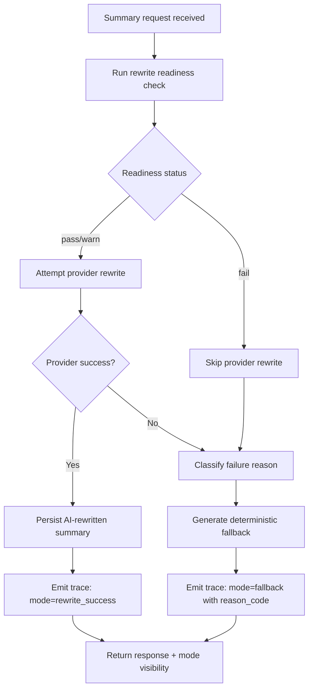

# Implementation Plan: AI Summary Rewrite Availability Hardening

**Feature ID:** RF-011  
**Generated:** 2026-06-30  
**Agent:** Tech Lead-equivalent (GPT-5.3-Codex)  
**Approach:** HYBRID (Modify existing summary pipeline + add readiness/classification governance)

---

## Executive Summary

**Feature:** AI Summary Rewrite Availability Hardening  
**Status:** Specification  
**Implementation Approach:** HYBRID  
**Estimated Complexity:** High  
**Risk Level:** Medium-High

The repository already supports summary generation, deterministic fallback, and trace logging. RF-011 focuses on reliability hardening: preflight rewrite readiness validation, explicit reason-code classification for unavailable rewrite paths, improved fallback governance, and user-visible summary mode transparency. The plan preserves API contracts while making rewrite availability measurable and operable.

---

## 1. Feature Analysis

### 1.1 Scope Boundaries

In scope:
1. Rewrite readiness validation at startup and/or endpoint preflight.
2. Failure classification for rewrite unavailability causes.
3. Trace/log enrichment with stable reason-code taxonomy.
4. Rewrite success-rate and fallback-rate measurement by environment.
5. Timeout/retry tuning to reduce premature fallback.
6. UI visibility for rewrite mode vs deterministic fallback mode.

Out of scope (non-goals):
1. Public schema changes for `SummaryResponse` and `SummaryUiResponse`.
2. Provider migration or model family replacement.
3. Full redesign of Run page layout.
4. Broad observability platform migration.

### 1.2 Key Requirements (From RF-011)

1. Validate provider prerequisites before summary generation.
2. Classify and trace rewrite unavailability causes.
3. Reduce unintended fallback in configured environments.
4. Improve user-visible summary mode transparency.

### 1.3 Dependencies

Prerequisites:
- RF-002 API Layer and Run Management
- RF-004 AI Integrations and Traceability
- RF-005 React UI Home and Run Experience
- RF-010 AI Summary Latency Optimization

Related:
- RF-007 Testing, Evaluation, and Quality Gates
- RF-008 Deployment, Security, and Operational Readiness

---

## 2. Existing Implementation Assessment

### 2.1 Current Coverage Summary

Status: Partially implemented (baseline behavior exists, governance incomplete)

What already exists:
1. Summary endpoints with fallback behavior.
2. Basic provider call handling and timeout configuration path.
3. Trace emission and run log append behavior.
4. UI summary loading and status surfaces.

What is missing for RF-011 completion:
1. Centralized rewrite readiness validator with explicit pass/warn/fail outcomes.
2. Stable reason-code taxonomy for rewrite unavailability classes.
3. Endpoint-level classification propagation into traces/logs/UI-safe status metadata.
4. Environment-level rewrite success/fallback rate reporting hooks.
5. Test coverage for readiness and failure classification matrix.

### 2.2 Impact Areas (Codebase)

Backend/API:
- `scripts/pallet_coach/api/app.py`
- `scripts/pallet_coach/api/models.py` (only if internal response metadata needs typed extension without contract break)

AI Provider Path:
- `scripts/pallet_coach/ai/azure_responses.py`
- `scripts/pallet_coach/ai/tracing.py`

UI:
- `UI/pallet_coach_ui/src/pages/Run.tsx`
- `UI/pallet_coach_ui/src/components/SummaryPanel.tsx`
- `UI/pallet_coach_ui/src/pages/Run.test.tsx`

Tests:
- `scripts/tests/test_api_ai_endpoints.py`
- `scripts/tests/test_ai_tracing.py`

Suggested new internal module:
- `scripts/pallet_coach/ai/rewrite_readiness.py`

---

## 3. Architecture and Flow Changes

### 3.1 Target Runtime Flow

### 3.2 Architectural Additions

1. Rewrite readiness evaluator:
   - Inputs: resolved config, provider metadata, endpoint context.
   - Outputs: readiness_status, reason_code, remediation_hint.

2. Failure reason-code taxonomy (initial set):
   - `config_missing`
   - `auth_error`
   - `endpoint_unreachable`
   - `deployment_mismatch`
   - `timeout`
   - `provider_error`

3. Trace shape extension:
   - `rewrite_mode`: `rewrite_success` | `deterministic_fallback`
   - `reason_code`: stable enum
   - `readiness_status`: `pass` | `warn` | `fail`

4. UI mode surface:
   - Show concise label for rewrite mode outcome.
   - Preserve non-blocking interactions.

### 3.3 Contract Compatibility

1. Keep existing response payload contracts intact.
2. Add mode details via existing trace/log channels and optional UI-friendly mapped state.
3. Avoid introducing required fields in existing API response schemas.

---

## 4. Reliability Targets and Release Gates

### 4.1 Proposed Operational Targets (to be approved)

Configured environment targets:
1. Rewrite success rate >= 95% for normal provider health windows.
2. Unintended fallback rate <= 5% outside provider incident windows.
3. Classified fallback events with reason code coverage = 100%.

Guardrail targets:
1. No increase in summary endpoint error-rate beyond +1.0 percentage point.
2. No regression of RF-010 latency gates due to RF-011 changes.

### 4.2 Gate Artifacts Required

1. Baseline rewrite/fallback distribution by environment.
2. Post-change rewrite/fallback distribution with reason-code breakdown.
3. Trace sample evidence for each reason-code class.
4. Release checklist confirming reliability + latency non-regression.

---

## 5. Phased Development Plan

## Phase 0: Baseline and Reason-Code Spec

Objectives:
1. Establish baseline fallback patterns.
2. Lock reason-code taxonomy and mapping rules.

Tasks:
1. Capture current fallback events and infer root-cause buckets from logs.
2. Finalize reason-code enum and ownership table.
3. Document expected classification behavior per failure type.

Exit criteria:
1. Baseline report produced.
2. Reason-code taxonomy approved.

## Phase 1: Rewrite Readiness Validator

Objectives:
1. Add centralized readiness checks.
2. Expose pass/warn/fail semantics for summary endpoints.

Tasks:
1. Implement internal readiness module (or endpoint-local equivalent).
2. Validate required config surfaces and safe defaults.
3. Wire readiness decision into summary and summary_ui flows.
4. Add unit tests for readiness matrix.

Exit criteria:
1. Readiness checks execute consistently for both endpoints.
2. Missing/malformed config paths classify correctly.

## Phase 2: Failure Classification and Trace Enrichment

Objectives:
1. Classify rewrite unavailability deterministically.
2. Persist reason-coded telemetry for all fallback events.

Tasks:
1. Map provider/runtime exceptions to stable reason codes.
2. Extend trace payload with mode/reason/readiness dimensions.
3. Ensure redaction/safe diagnostics remain intact.
4. Add integration tests for classification paths.

Exit criteria:
1. 100% fallback events include reason code.
2. Existing trace readers remain compatible.

## Phase 3: Timeout/Retry Calibration

Objectives:
1. Reduce premature fallback due to overly strict budgets.
2. Preserve bounded latency and reliability.

Tasks:
1. Tune timeout and retry policy under representative conditions.
2. Validate no RF-010 latency regression.
3. Validate fallback behavior remains deterministic and safe.

Exit criteria:
1. Rewrite success-rate target improves vs baseline.
2. Tail latency remains within RF-010 guardrails.

## Phase 4: UI Summary Mode Transparency

Objectives:
1. Make rewrite/fallback mode visible to users.
2. Preserve current workflow ergonomics.

Tasks:
1. Add mode status display in Run summary panel.
2. Map internal reason codes to concise user-safe messages.
3. Add tests for mode display and non-blocking behavior.

Exit criteria:
1. UI shows summary mode accurately for success/fallback paths.
2. Existing run interactions remain non-blocking.

## Phase 5: Verification and Rollout

Objectives:
1. Validate release gates.
2. Roll out safely with monitoring and rollback criteria.

Tasks:
1. Execute test suite and reliability benchmark checks.
2. Deploy via staged environments.
3. Monitor rewrite success rate and reason-code distribution.
4. Trigger rollback if reliability/latency guardrails are violated.

Exit criteria:
1. All gates passed with evidence.
2. Rollout approved by feature owner.

---

## 6. File-Level Work Plan

### Files to Modify

1. `scripts/pallet_coach/api/app.py`
- Add readiness check integration and reason-code propagation.
- Ensure summary endpoints classify fallback outcomes consistently.

2. `scripts/pallet_coach/ai/azure_responses.py`
- Return richer error metadata for classifier mapping.
- Keep provider wrapper contract backward compatible.

3. `scripts/pallet_coach/ai/tracing.py`
- Persist new dimensions for rewrite mode/reason/readiness.

4. `UI/pallet_coach_ui/src/pages/Run.tsx`
- Surface summary mode status in run flow.

5. `UI/pallet_coach_ui/src/components/SummaryPanel.tsx`
- Render concise status message for rewrite mode.

6. `scripts/tests/test_api_ai_endpoints.py`
- Add readiness and reason-code path assertions.

7. `scripts/tests/test_ai_tracing.py`
- Validate mode/reason/readiness trace persistence.

8. `UI/pallet_coach_ui/src/pages/Run.test.tsx`
- Validate UI mode visibility and non-blocking behavior.

### Files to Create

1. `scripts/pallet_coach/ai/rewrite_readiness.py`
- Centralized readiness evaluation and diagnostics classification helpers.

2. Optional reliability report artifact path (recommended)
- `eval/reports/rf011_rewrite_availability_baseline.md`
- `eval/reports/rf011_rewrite_availability_postchange.md`

---

## 7. Risk Mitigation and Rollback

### Key Risks

1. Misclassification of provider errors produces noisy diagnostics.
- Mitigation: deterministic exception mapping tests with fixtures.

2. Aggressive readiness fail path suppresses valid rewrite attempts.
- Mitigation: pass/warn/fail semantics with controlled warn-path behavior.

3. Additional checks increase endpoint latency.
- Mitigation: lightweight checks and RF-010 latency non-regression gate.

4. UI messaging causes user confusion.
- Mitigation: concise language, fallback-safe copy review, UX test coverage.

### Rollback Criteria

Trigger rollback if:
1. Rewrite success rate drops below baseline for two monitoring windows.
2. Unclassified fallback events exceed 1%.
3. RF-010 latency/error-rate guardrails regress beyond thresholds.

---

## 8. Verification and Test Strategy

### Unit Tests

1. Readiness validator matrix tests.
2. Error-to-reason-code classification tests.
3. Safe diagnostic redaction tests.

### Integration Tests

1. Summary endpoint rewrite success path.
2. Summary endpoint classified fallback paths by reason code.
3. Trace/log payload completeness for fallback events.

### UI Tests

1. Rewrite success mode visible in summary panel.
2. Deterministic fallback mode visible with concise message.
3. Non-blocking interaction behavior unchanged.

### Reliability Validation

1. Baseline vs post-change rewrite/fallback distribution.
2. Reason-code coverage audit.
3. RF-010 latency non-regression check.

---

## 9. Critical Path

1. Reason-code taxonomy approval.
2. Central readiness validator implementation.
3. Endpoint classification + trace enrichment.
4. Reliability gate pass with non-regression evidence.

---

## 10. Open Decisions and Blockers

Open decisions:
1. Final rewrite success-rate and fallback-rate thresholds per environment.
2. Whether readiness fail should be startup-fatal or endpoint-local fail-open/fail-safe.
3. Whether summary mode metadata should be persisted in bundle artifacts beyond traces.

Potential blockers:
1. Incomplete environment parity across local, Docker, and hosted runtime.
2. Insufficient provider incident labeling for baseline normalization.
3. Missing log retention/query patterns for reason-code trend analysis.

---

## 11. Developer Checklist

- [ ] Approve reason-code taxonomy and thresholds.
- [ ] Implement centralized rewrite readiness validator.
- [ ] Integrate readiness and classification into summary endpoints.
- [ ] Enrich tracing with rewrite mode/reason/readiness fields.
- [ ] Add UI summary mode transparency.
- [ ] Add/extend unit, integration, and UI tests.
- [ ] Generate baseline vs post-change reliability reports.
- [ ] Validate RF-010 latency non-regression.
- [ ] Execute staged rollout and monitor rollback criteria.

---

## 12. Recommended Next Agent

Recommended next agent: developer

Rationale:
1. RF-011 now has implementation-ready technical decomposition and sequencing.
2. Architecture-level direction is sufficiently bounded by RF-010 and this plan; development can proceed with targeted code changes and tests.
3. After implementation, `performancetester` should validate reliability distributions and non-regression gates.
